これはなに
==========
Terraformnを使ってOKEのクラスターをプロビジョニングする手順を記します。

OCIのGUIコンソールを使ってOKEクラスターを作成する方法は、[OKEの始め方](https://qiita.com/hhiroshell/items/5e812a4cccbdbb16a3fb)を参照ください。


動作確認できている条件
----------------------
Ubuntu 18.04のクライアントPCで動作確認済みです。


全体の流れ
==========
手順の大まかな流れは以下のとおりです。

1. OCIでの準備作業
2. CLIツール類をセットアップする
3. OKEクラスターをプロビジョニングする


1 . OCIでの準備作業
===================
まずはじめに、OCIにOKE用の領域(Compartment)とTerraformの実行ユーザーとなるアカウントを作成していきます。


1.1. Compartmentを作成する
--------------------------
CompartmentはOCIのテナントの内部を仕切る区画で、その中に各種リソースを配置したり、CompartmentにPolicyを割り当てることを通じてアカウントの権限を管理したりすることができます。<br>
ここでは、Kubernetesクラスターとそれを構成するための各種リソースを配置するCompartmentを作成します。

はじめに、OCIのコンソール左上のメニューを展開し、[Identity] > [Compartments]をクリックします。

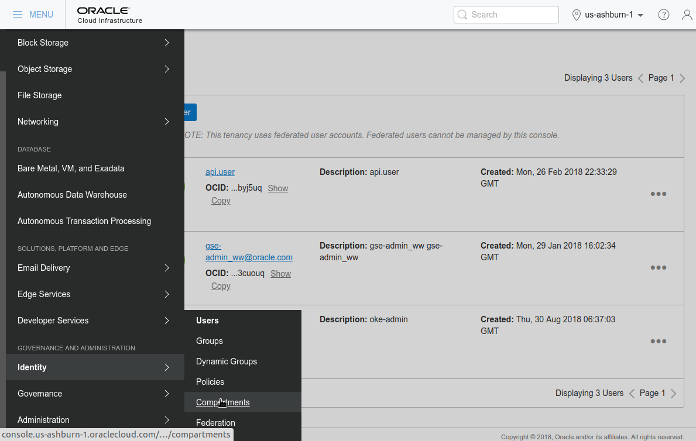

[Compartments]画面で[Create Compartment]ボタンをクリックします。


"Create Compartment"ダイアログで以下のように値を設定し、"Create Compartment"ボタンをクリックします。

- NAME: oke-compartment
- DESCRIPTION: For OKE and other resources
- （上記以外はデフォルトのまま）

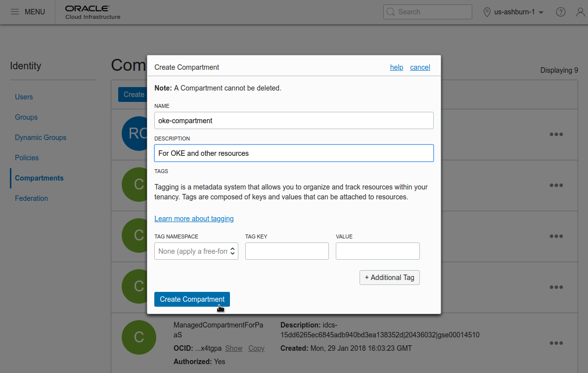

続いて表示されるCompartmentの一覧画面で[oke-compartment]を探して、このCompartmentのOCIDを取得しておきます。
oke-compartmentが表示されている領域の[Copy]をクリックすると、OCIDがクリップボードに保存されますので、テキストエディタ等にペーストして控えておいてください。

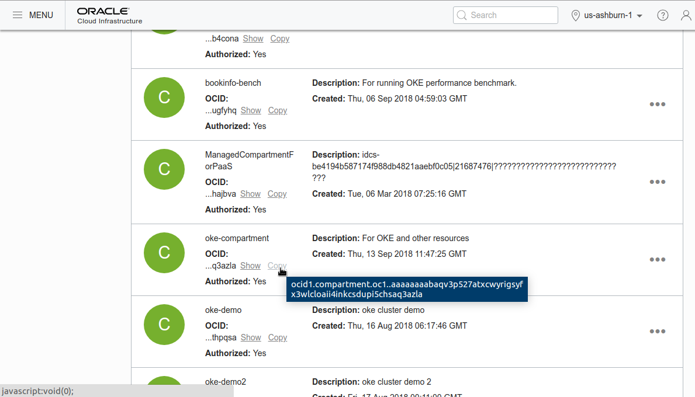

以上で、Compartmentの作成は完了です。


1.2. Terraformの実行ユーザー用のGroupを作成する
-----------------------------------------------
Compartmentの管理者アカウントが所属するためのGroupを作成します。

画面左のメニューで"Groups"をクリックし、更に"Create Group"ボタンをクリックします。

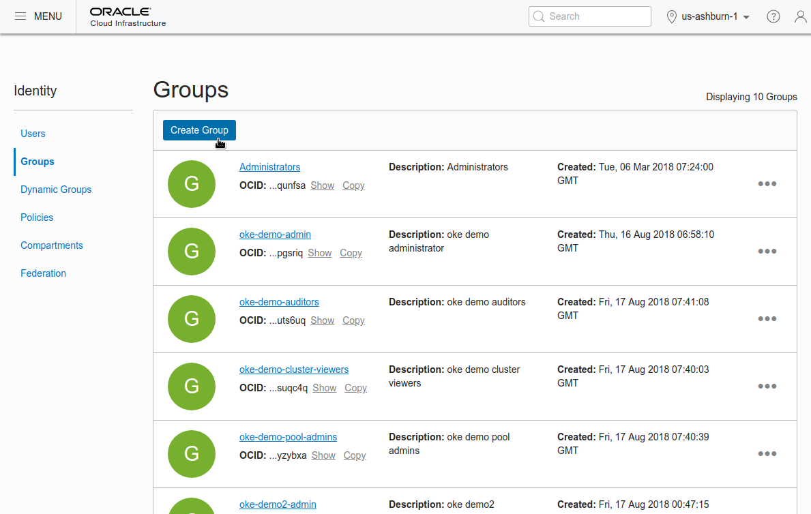

"Create Group"ダイアログで以下のように値を設定し、"Submit"ボタンをクリックします。

- NAME: k8s\_administrators
- DESCRIPTION: k8s administrators
- （上記以外はデフォルトのまま）

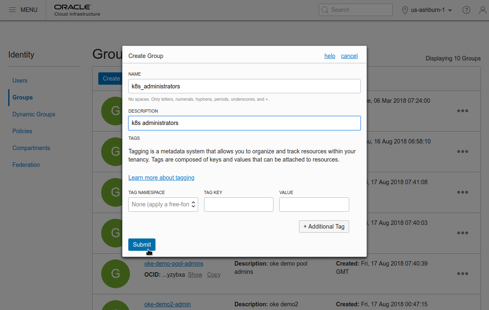

以上で、管理者アカウント用のGroupの作成は完了です。


1.3. Groupに適用するPolicyを作成する
------------------------------------
所定のPolicyを設定することによって、目的のGroupに権限を割り当てることができます。<br>
ここでは、管理者アカウント用のGroupに割り当てるためのPolicyを作成します。ここで作成するPolicyは、Compartmentに対する全権限を持ちます。

画面左のメニューで"Policies"をクリックします。画面のタイトルが「Policies in...」に変わったら、画面左下にある[List Scope]メニューで[oke-compartment]を選択し、さらに[Create Policy]ボタンをクリックします。

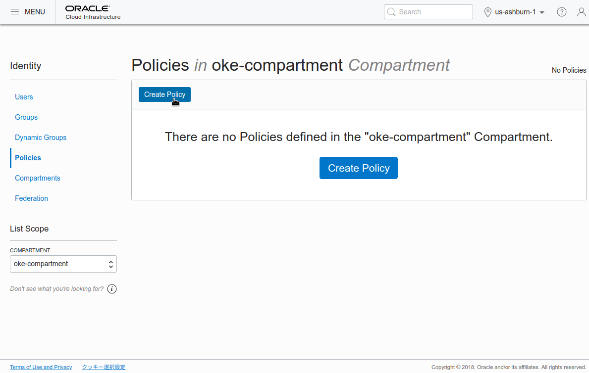

"Create Policy"ダイアログで以下のように値を設定し、"Create"ボタンをクリックします。

- NAME: k8s\_admin\_policy
- DESCRIPTION: Grants users full permissions on the k8s compartment
- Policy Statements
    * STATEMENT: Allow group k8s_administrators to manage all-resources in compartment oke-compartment
- （上記以外はデフォルトのまま）

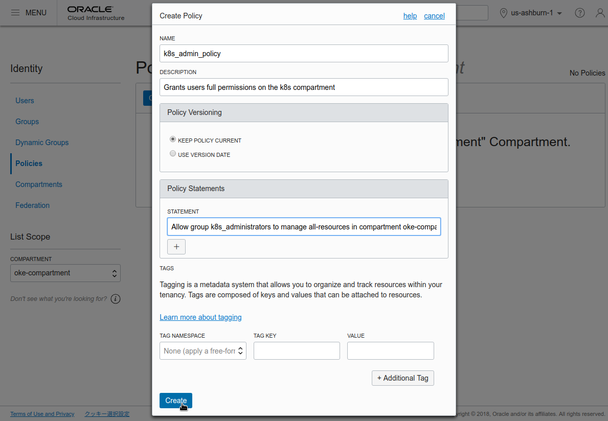

以上で、Groupに適用するPolicyの作成は完了です。


1.4. Terraformの実行ユーザーを作成する
--------------------------------------
このCompartmentの管理者となるUserを作成し、Terraformの実行ユーザーとして利用します。<br>
このUserは、ここまでの手順で作成した管理者アカウント用のGroupに所属することによって、Compartmentに対する全権限を持つようにします。

画面左のメニューで[Users]をクリックし、更に[Create User]ボタンをクリックします。

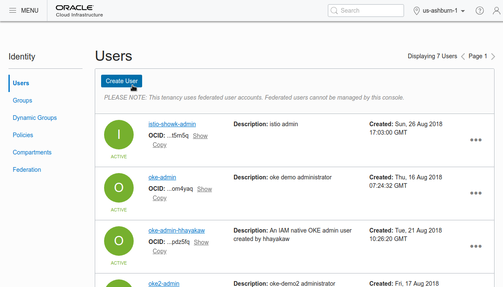

[Create User]ダイアログで以下のように値を設定し、[Create]ボタンをクリックします。

- NAME: oke-api-user
- DESCRIPTION: Admin of the oke-compartment as api user
- （上記以外はデフォルトのまま）

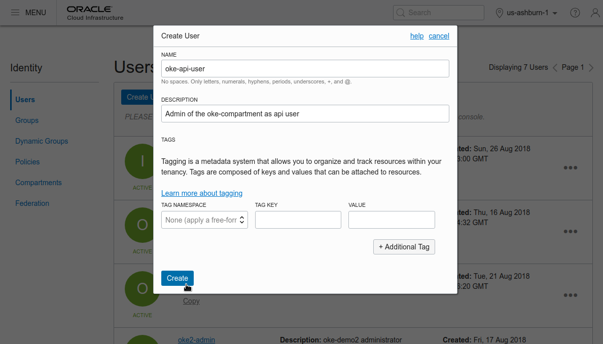

ユーザーの一覧画面で、[oke-api-user]をクリックします。

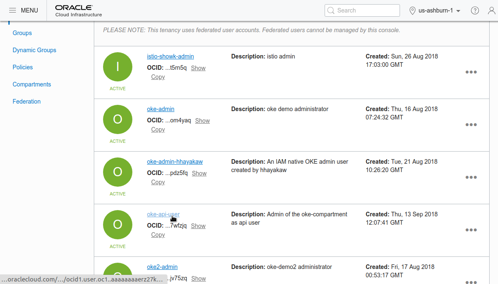

画面左下にあるメニューで[Groups]をクリックし、更に[Add User to Group]ボタンをクリックします。

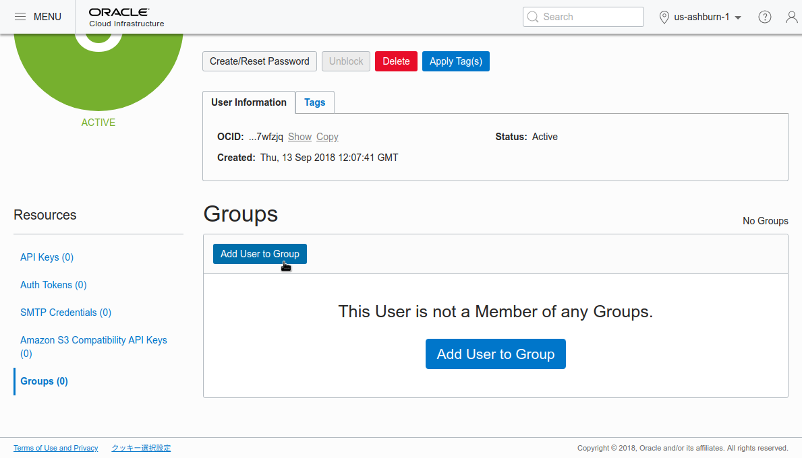

[Add User To Group]ダイアログで、[k8s\_administrators]を選択し、[Add]ボタンをクリックします。

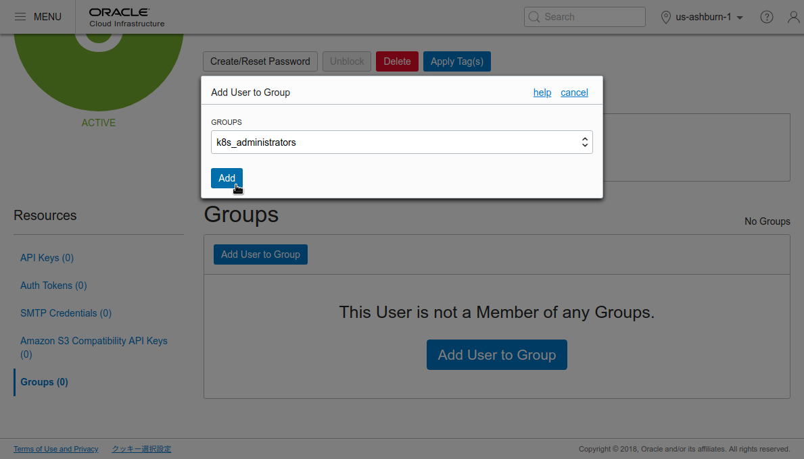

このユーザーには後の手順で更に設定を追加するので、ブラウザはこのままにしておきます。


2 . CLIツール類をセットアップする
=================================
Terraformとoke-terraform-provisionerを利用してOKEクラスターを構築するために、必要なCLIツールのセットアップを行っていきます。


2.1. OCIのCLIをセットアップする
-------------------------------

### 2.1.1. OCIDの確認
ブラウザに表示されている、oke-api-userユーザーの詳細情報の画面で”User Information"タブ内にユーザーのOCIDが表示されている箇所があります。OCIDの値の右にある"Copy"をクリックすると、クリップボードにOCIDがコピーされるので、これを手元のテキストエディタなどにペーストしておきます。

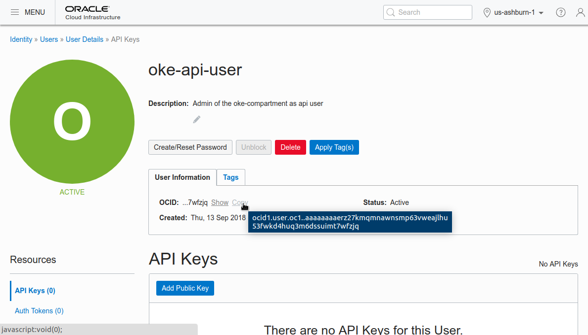

次に、コンソール右上の人形のアイコンをクリックし、テナント名の箇所をクリックします

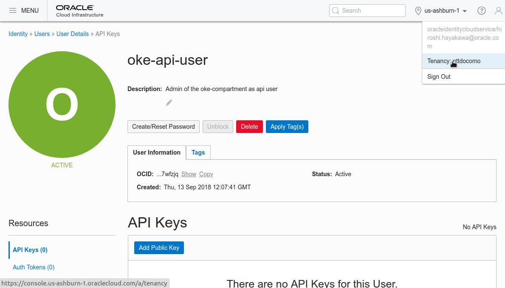

Tenantの詳細情報の画面で”Tenancy Information"タブ内にOCIDが表示されている箇所があります。OCIDの値の右にある"Copy"をクリックすると、クリップボードにOCIDがコピーされるので、これを手元のテキストエディタなどにペーストしておきます。

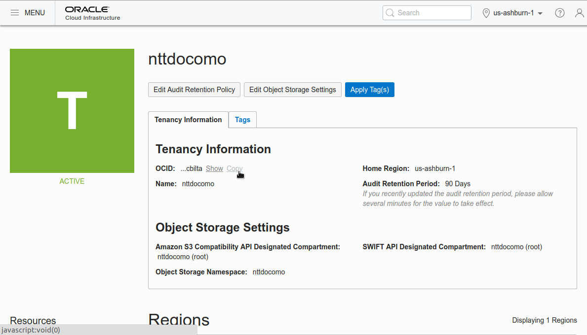

### 2.1.2. OCI CLIのセットアップ
OCI CLIをインストールするには、以下のコマンドを実行します。

    bash -c "$(curl -L https://raw.githubusercontent.com/oracle/oci-cli/master/scripts/install/install.sh)"

CLIのバイナリの配置先などを設定するインタラクションがあります。自身の環境に合わせて、好みの設定を行ってください（全てデフォルトのままで進めても問題ありません）。

インストールが完了したら、OCI CLIの初期セットアップを行います。以下のコマンドを実行してください。

    oci setup config

ここでも設定をおこなうためのインタラクションがあります。ここでは、以下のように入力してください。この例では、インタラクションの途中でAPIキーを生成しますが、もし別途用意していあるAPIキーを使用する場合は Do you want to generate a new RSA key pair? という質問にNと答えてください。

- Enter a location for your config [/home/<ユーザー名\>/.oci/config]: 入力なしでENTERキーを押す
- Enter a user OCID: - 先の手順で確認したユーザーのOCIDを入力
- Enter a tenancy OCID: - 先の手順で確認したテナントのOCIDを入力
- Enter a region (e.g. eu-frankfurt-1, us-ashburn-1, us-phoenix-1): アクセスしたいリージョンを例に従って入力
- Do you want to generate a new RSA key pair? (If you decline you will be asked to supply the path to an existing key.) [Y/n]: - Y
- Enter a directory for your keys to be created [/home/<ユーザー名\>/.oci]: - 入力なしでENTERキーを押す
- Enter a name for your key [oci\_api\_key]: - 入力なしでENTERキーを押す
- Enter a passphrase for your private key (empty for no passphrase): - 任意のパスフレーズを入力

CLIからOCIに対してアクセスを行う際には、OCIのAPIの認証が行われます。このため予め認証をパスするのに必要なAPIキーを、ユーザー毎にOCIにアップロードしておく必要があります。

OCI CLIの初期セットアップの際に作成した鍵ペアのうち、公開鍵の方を、管理コンソールからアップロードします。

まず、以下のターミナルで以下のコマンドを実行し、公開鍵を表示しておきます。

    cat ~/.oci/oci_api_key_public.pem

続いてOCIのコンソールに戻り、OCIのコンソール左上のメニューを展開し、[Identity] > [Users]をクリックします。


ユーザーの一覧で[oke-api-user]を選択します。

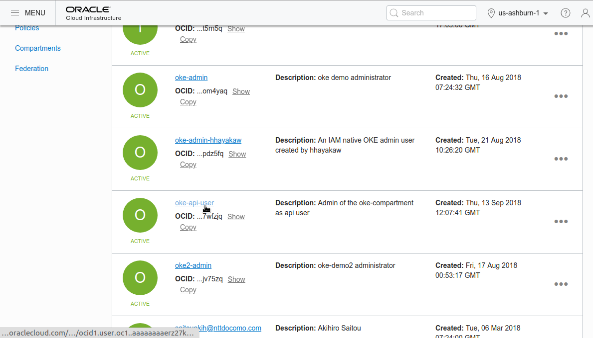

ユーザーの詳細画面の左側のメニューで、[API Keys]をクリックし、さらに[Add Public Key]ボタンをクリックします。

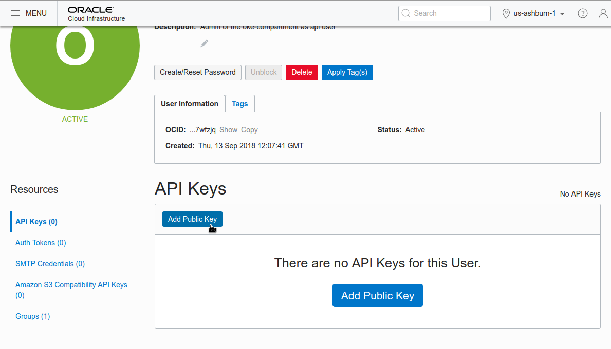

”Add Public Key"ダイアログの入力欄に、先ほとターミナルに表示した公開鍵をペーストし、"Add"ボタンをクリックします（"-----BEGIN PUBLIC KEY-----"と"-----END PUBLIC KEY-----"の行も含めてペーストします）。


ユーザーの詳細画面に戻ると、API Keyの一覧に公開鍵のFingerprintが表示されます。この文字列は後で利用するため、テキストエディタ等にコピーして控えておきます。


以上でOCI CLIのセットアップは完了です。


2.2. Terraformをインストールする
--------------------------------
Terraformをインストールします。利用するPCのプラットフォームに合わせて公式のバイナリをダウンロードして、PATHをとおせばOKです。<br>
ダウンロードするバイナリのURLを確認するには、[公式のダウンロードページ](https://www.terraform.io/downloads.html)を参照します。

以下は、Ubuntu 18.04でインストールする例です。

    > wget https://releases.hashicorp.com/terraform/0.11.8/terraform_0.11.8_linux_amd64.zip
    > unzip terraform_0.11.8_linux_amd64.zip
    > sudo mv terraform /usr/local/bin/

正しくインストールされているか確認します。

    > terraform --version
    Terraform v0.11.8


2.3. terraform-provider-ociをインストールする
---------------------------------------------
TerraformからOCIを操作するためのプラグインをインストールします。こちらも、利用するPCのプラットフォームに合わせて、適切なものをダウンロードします。
ダウンロード対象のURLの確認は[GithubのReleases](https://github.com/oracle/terraform-provider-oci/releases)を参照してください。

同じくUbuntu 16.04でインストールする例です。

    > wget https://github.com/oracle/terraform-provider-oci/releases/download/v2.2.4/linux_amd64.tar.gz
    > tar xvf linux_amd64.tar.gz

Terraformのプラグインは、``~/.terraform.d/plugins``に配置します。このディレクトリがなければ、新たに作成しておきます。

    > mkdir -p ~/.terraform.d/plugins

最後に、上のディレクトリにプラグイン本体をコピーします。

    > mv linux_amd64/terraform-provider-oci_v2.2.4 ~/.terraform.d/plugins/


以上で、CLIツール類のセットアップは完了です。


3 . OKEクラスターをプロビジョニングする
---------------------------------------
ここまでの手順で、Terraformを使ってOKEクラスターをプロビジョニングするための環境が出来上がっています。<br>

ここでは、実際にoke-terraform-provisionerを実行して、OKEをプロビジョンニングします。

### 3.1. Terraform Kubernetes Installerを準備する
[oke-terraform-provisioner](https://hiroshi.hayakawa%40oracle.com@soepoc-nttdocomo.uscom-central-1.oraclecloud.com/soepoc-nttdocomo/s/soepoc-nttdocomo_soepoc_4042/scm/oke-terraform-provisioner.git)をcloneします。

    > git clone https://hiroshi.hayakawa%40oracle.com@soepoc-nttdocomo.uscom-central-1.oraclecloud.com/soepoc-nttdocomo/s/soepoc-nttdocomo_soepoc_4042/scm/oke-terraform-provisioner.git
    > cd oke-terraform-provisioner/


OKEクラスターの構成を、Terraformのパラメータファイル``terraform.tfvars``に記述する設定によって変更することができます。

ベースとなるパラメータファイルをコピーして、これを編集していきます。

    > cp terraform.example.tfvars terraform.tfvars
    > vim terraform.tfvars

パラメータファイルの冒頭に、OCIの環境情報とAPIアクセスキーの設定情報を記述している箇所があります。ここのパラメータを、1-3. で収集したものに変更していきます。<br>
また、1-1. で作成したAPIアクセスキー（秘密鍵の方）のパスと、利用するOCIのリージョンもここで指定します。。

対象のパラメータは以下のとおりです。

|key                 |value                         |
|---                 |---                           |
|tenancy\_ocid       |OCIのテナントのOCID           |
|user\_ocid          |Compartmentの管理者のOCID     |
|fingerprint         |APIアクセスキーのFingerprint  |
|private\_key\_path  |APIアクセスキー               |
|compartment\_ocid   |CompartmentのOCID             |
|region              |データセンターのリージョン    |

その他、Kubernetesの各ノードのシェイプや、ファイヤーウォールの設定をしていきます。

以下に、パラメータファイルの記述例を示します。

```properties
# OCI
tenancy_ocid = "ocid1.tenancy.oc1..xxxxxxxxxxxxxxxxxxxxxxxxxxxxxxxxxxxxxxxxxxxxxxxxxxxxxxxxxxxx"
user_ocid = "ocid1.user.oc1..xxxxxxxxxxxxxxxxxxxxxxxxxxxxxxxxxxxxxxxxxxxxxxxxxxxxxxxxxxxx"
fingerprint = "00:11:22:33:44:55:66:77:88:99:aa:bb:cc:dd:ee:ff"
private_key_path = "/home/hhiroshell/.oci/oci_api_key.pem"
compartment_ocid = "ocid1.compartment.oc1..xxxxxxxxxxxxxxxxxxxxxxxxxxxxxxxxxxxxxxxxxxxxxxxxxxxxxxxxxxxx"
region = "us-ashburn-1"

# General
oke_resource_prefix = "example"

# OKE Cluster
oke_cluster_name = "my-first-cluster"
oke_kubernetes_version = "v1.11.1"
oke_kubernetes_dashboard_enabled = false
oke_helm_tiller_enabled = false
oke_node_pool_name = "my-first-node-pool"
oke_kubernetes_node_version = "v1.11.1"
oke_node_pool_node_image_name = "Oracle-Linux-7.5"
oke_node_pool_shape = "VM.Standard2.2"
oke_node_pool_quantity_per_subnet = 1
oke_kube_config_expiration = 2592000
oke_kube_config_token_version = "1.0.0"
```

### 3.2. Terraform Kubernetes Installerを実行する
いよいよTerraform Kubernetes Installerを実行し、クラスターを構築します。

まずは``terraform init``でプラグイン等を含めた初期化を行う必要があります。

    > terraform init
    …
    Terraform has been successfully initialized!

続いて``terraform plan``を実行します。

    > terraform plan
    ...
    Plan: 13 to add, 0 to change, 0 to destroy.

この時点では、まだ実際の環境構築は行われていません。ここまで特にエラーの発生がなく進んでいれば、最後に``terraform apply``を実行して環境の構築を開始します。

    > terraform apply

構築には、しばらく時間がかかります。この間OCIのサービス・コンソールを見ると、Kubernetesに必要なネットワークや、クラスターが作られて行っていることが確認できます。

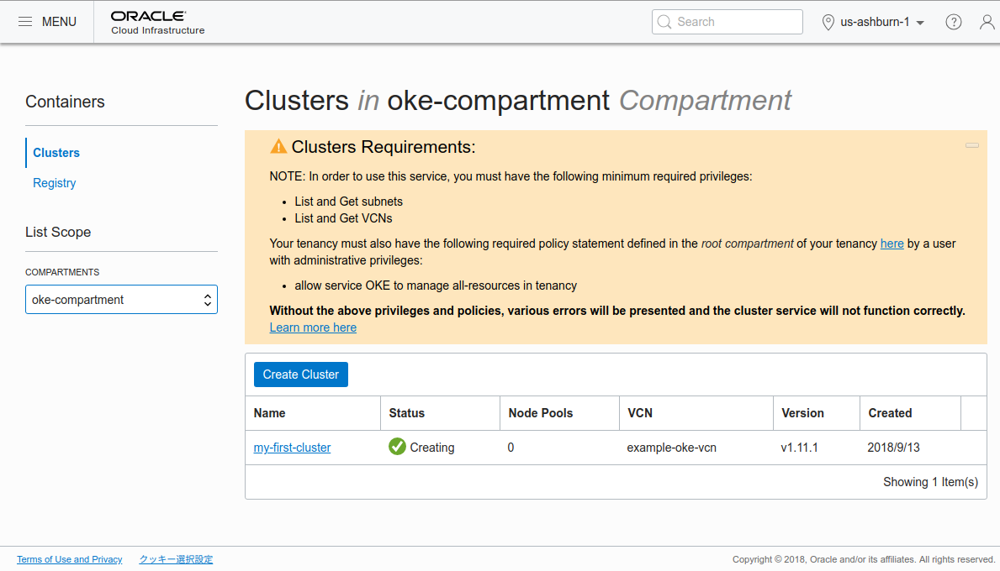

以上で、OCI上にKubernetesクラスターを構築することができました。


### 3.3. kubectlによるOKEクラスターへのアクセス
ここまでの手順で構築したOKEクラスターに、kubectlでアクセスしてみます。

kubectlの設定ファイルは、oke-terraform-provisionerを実行したときに、[generated]ディレクトリと共に自動で生成されています。kubectl実行時に、この設定ファイルを利用するようにすればOKです。

この例は、環境変数[KUBECONFIG]に設定ファイルのパスを指定する方法です。

    > export KUBECONFIG=~/terraform-kubernetes-installer/generated/kubeconfig

クラスターの一般情報を取得するコマンドで、動作を確認してみます。以下のような応答が返れば、正常にクラスターにアクセスできています。

    > kubectl cluster-info
    Kubernetes master is running at https://xxx.xxx.xxx.xxx:443
    KubeDNS is running at https://xxx.xxx.xxx.xxx:443/api/v1/namespaces/kube-system/services/kube-dns:dns/proxy
    
    To further debug and diagnose cluster problems, use 'kubectl cluster-info dump'.


以上で、OracleのIaaS上にTerraformを使ってKubernetesクラスターを作ることができました。
お疲れ様でした！


### 3.4. クリーンアップ
クラスターを削除する場合は、``terraform destroy``を実行します。

    > terraform destroy

この操作により、クラスターを含む、この章で作成した全てのリソースが削除されます。
``terraform apply``を再度実行すると、同等の設定のクラスターを同じように作成することができます。
